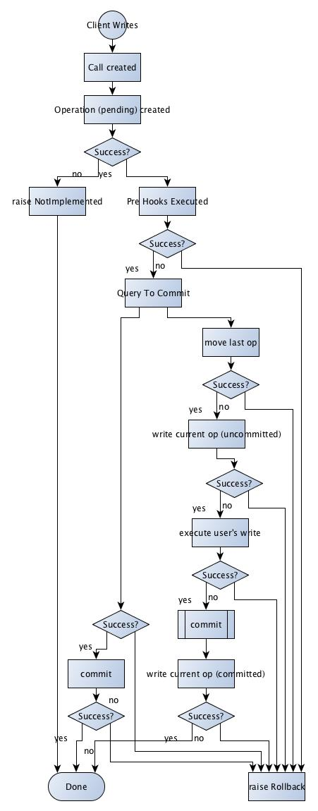

Client
======

How it works
------------

To make things easy for you; we provide a client that implements routing, majority votes, recovery, etc so you have reliability and atomicity in your interactions with you hodge-podge of redis master nodes.

The client implements all the standard functions of :py:class:`redis.StrictRedis`. They're not documented there since we just built a wrapper for that client. You can find the documentation for :py:class:`redis.StrictRedis` on the project page, https://redis-py.readthedocs.org/en/latest/

The client implements our own version of the two-phase commit protocol. Since each of redis' operations is individually atomic; we can execute the "rollback" operation at any time with no risk of ambiguous state. Schematically it works as follows:

Module Reference
----------------
.. automodule:: phonon.client
    :members:
