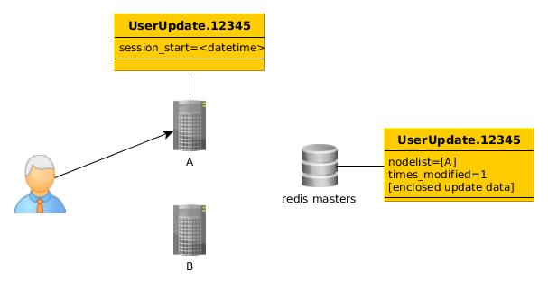
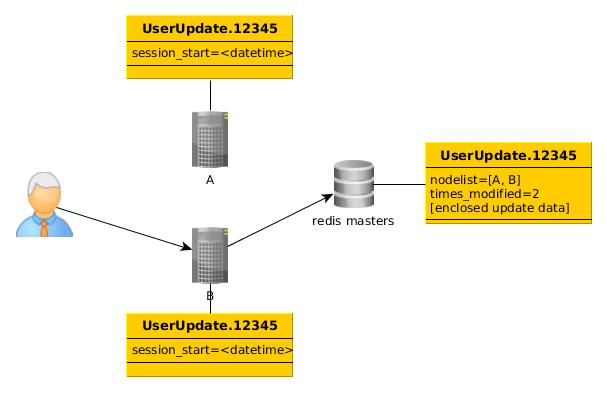
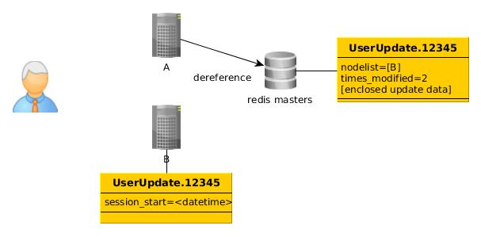
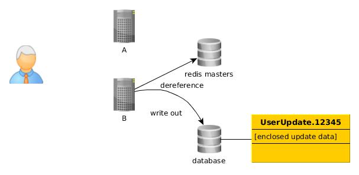

References
----------

One of the building blocks for Phonon’s approach to coordination is reference counting. Coordinated objects each have a unique identifier per-aggregated structure. This is referred to as the resource_key. When two updates come in for the same resource_key on different worker machines, coordination is required.

The first step in reference counting occurs, for example, when a user lands on a page. A UserUpdate is created on node A (below) when the tracking code sends a message to that node. It includes data about that update to be aggregated as well as the start time for the session. Session lengths are part of the UserUpdate type definition. 

At the time the UserUpdate object is created on node A a Reference to it is created on the Redis master nodes corresponding to the shard for resource_key using the Redlock algorithm to ensure the Reference is modified exclusively. If the lock fails to acquire an exception is raised so the UserUpdate message can be requeued by the message bus. 

The Reference on Redis contains a list of nodes holding a reference to that object as well as the number of times the UserUpdate payload has been cached to Redis. At the time the UserUpdate object is created the update data is cached to redis and the UserUpdate object is cleared on node A, so the update exists only on the multiple Redis masters serving the shard.

The next typical step in aggregation is when another event is recorded on node B. At this point both A and B have similar references to UserUpdate.12345.

No one has written any payload to Redis, but that is about to change. The next step is when the UserUpdate session expires on node A (since it was the first to get the message it will be first to expire). Even if delivery times for the message is affected by latency the user-defined merge operation is responsible for resolving conflicts in merge order. The recommended solution is to include timestamps on the message appended to the message body by the message bus/API.

When A dereferences it removes itself from the nodelist for the record before unlocking.

Now the session ends on node B. B is aware there is information on Redis to get and merge into it’s local record.  Seeing there is only one node in the nodelist confirms B holds the final remaining reference to UserUpdate.12345, meaning it is now time to merge it’s record with the record cached on Redis and write the result to the database before dereferencing.

If the database becomes unavailable a write can be retried. If the database is expected to be gone for a while, the user can extend the session for the update to keep it floating around a while longer. 

.. automodule:: phonon.reference
    :members:
